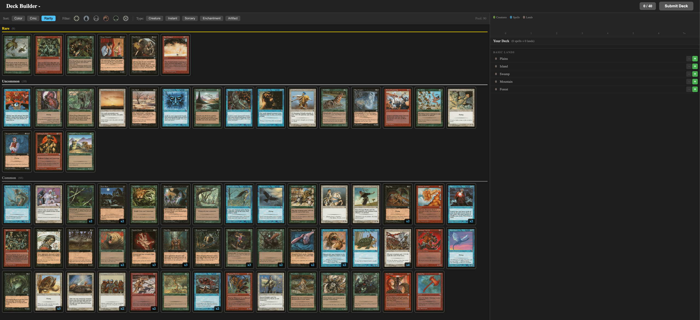
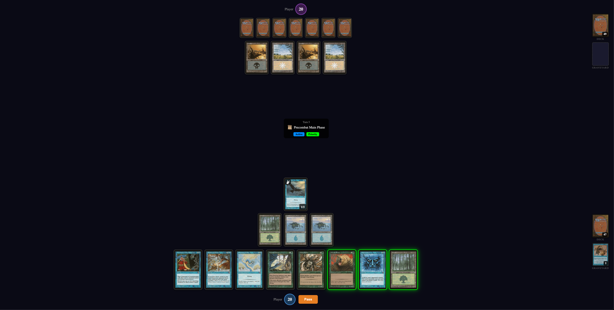

# Argentum Engine


*Before the oil. Before the corruption. There was only perfection.*

An unofficial Magic: The Gathering rules engine and online play platform. Not affiliated with, endorsed, sponsored, or specifically approved by Wizards of the Coast LLC.

**[Play now at magic.wingedsheep.com](https://magic.wingedsheep.com)**

---

## Overview

Argentum Engine is a modular MTG implementation consisting of:

- **Rules Engine** — A deterministic Kotlin library implementing MTG comprehensive rules
- **Game Server** — Spring Boot backend for online multiplayer
- **Web Client** — Browser-based UI

## Getting Started

### Prerequisites

- JDK 21+
- Node.js 18+
- Docker (optional, for Redis)
- [just](https://github.com/casey/just) command runner

### Quick Start

```bash
# Initialize environment
just init

# Start Redis (optional, for session persistence)
just docker-up

# Start the game server
just server

# In another terminal, start the web client
just client
```

The client runs at `http://localhost:5173` and connects to the server at `http://localhost:8080`.

### Available Commands

**Build & Test**
| Command | Description |
|---------|-------------|
| `just build` | Build the entire project |
| `just test` | Run all tests |
| `just test-rules` | Run rules-engine tests only |
| `just test-server` | Run game-server tests only |
| `just clean` | Clean build artifacts |

**Development**
| Command | Description |
|---------|-------------|
| `just server` | Start the game server |
| `just client` | Start the web client dev server |
| `just client-install` | Install web client dependencies |

**Environment**
| Command | Description |
|---------|-------------|
| `just init` | Create `.env` from `.env.example` |
| `just docker-up` | Start local Docker services (Redis) |
| `just docker-down` | Stop local Docker services |
| `just docker-logs` | View Docker logs |

### Environment Variables

Copy `.env.example` to `.env` to configure:

| Variable | Default | Description |
|----------|---------|-------------|
| `CACHE_REDIS_ENABLED` | `false` | Enable Redis for session persistence |
| `REDIS_HOST` | `localhost` | Redis host |
| `REDIS_PORT` | `6379` | Redis port |

## Tech Stack

- Kotlin 2.2
- Spring Boot 4.x
- React / TypeScript (frontend)
- Redis (optional session persistence)
- Keycloak (OAuth/authentication)

## Features

### Drafting



Host booster drafts with up to 8 players. Create a draft lobby, invite friends, and build your deck from freshly opened packs.

### Play



Play Magic against friends with fully implemented MTG rules. The engine automatically handles the stack, priority, combat, triggers, and state-based actions—so you can focus on the game.

## Architecture

```
argentum/
├── rules-engine/               # Core rules, zones, actions, keywords
├── sets/
│   └── portal/                 # First supported set
│       └── card-scripts/       # Per-card ability scripts
├── server/                     # Game server & matchmaking
└── client/                     # Web frontend
```

## Rules Engine

The rules engine is a standalone library with no server dependencies. It models the complete game state immutably and
exposes a pure functional API:

### Features

- Full turn structure (phases, steps, priority)
- Stack and spell resolution
- Combat (attackers, blockers, damage assignment)
- Triggered and activated abilities
- Keywords (flying, trample, deathtouch, etc.)
- State-based actions
- Targeting and legality checks

### Card Scripts

Cards are defined as scripts that compose core abilities:

## Gameplay Platform

### Server

- OAuth login via Keycloak (Google account)
- Create games with invite links
- Deck builder from available cards
- Booster draft with friends

### Client

- WebGL-based card rendering
- Real-time game state sync
- Card images

## Roadmap

1. **Phase 1** — Core rules engine with Portal set
2. **Phase 2** — Server infrastructure and matchmaking
3. **Phase 3** — Web client MVP
4. **Phase 4** — Draft mode
5. **Phase 5** — Additional sets

## Why "Argentum"?

Argentum was a plane of mathematical perfection, created by the planeswalker Karn. Every angle intentional, every law
absolute. It was governed by rules so elegant they seemed inevitable.

That's what a rules engine should be.
