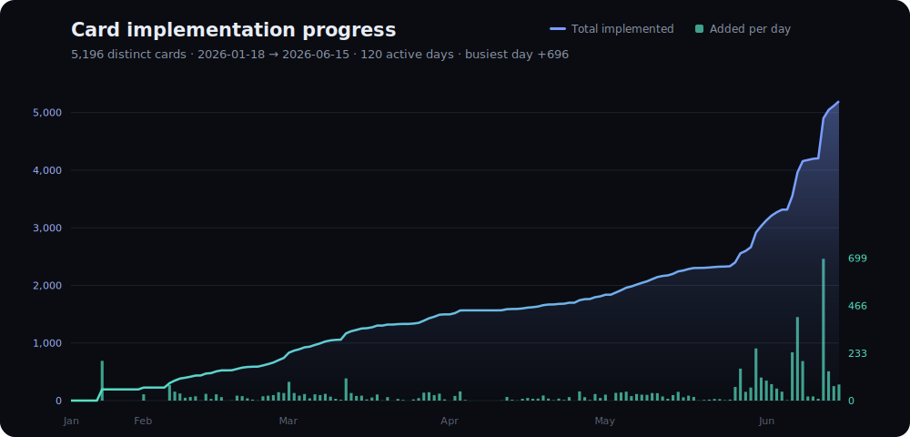
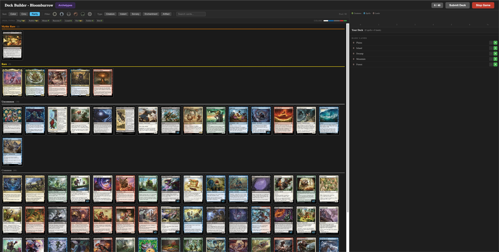
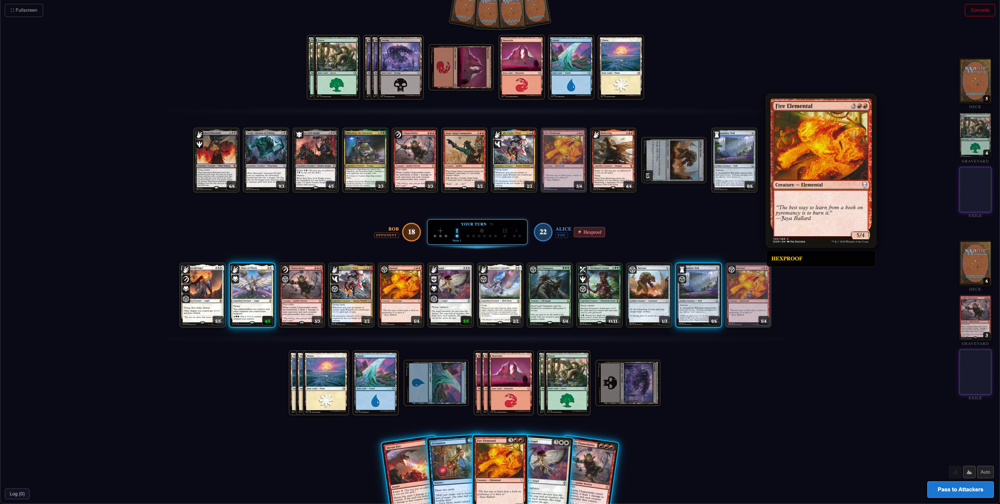
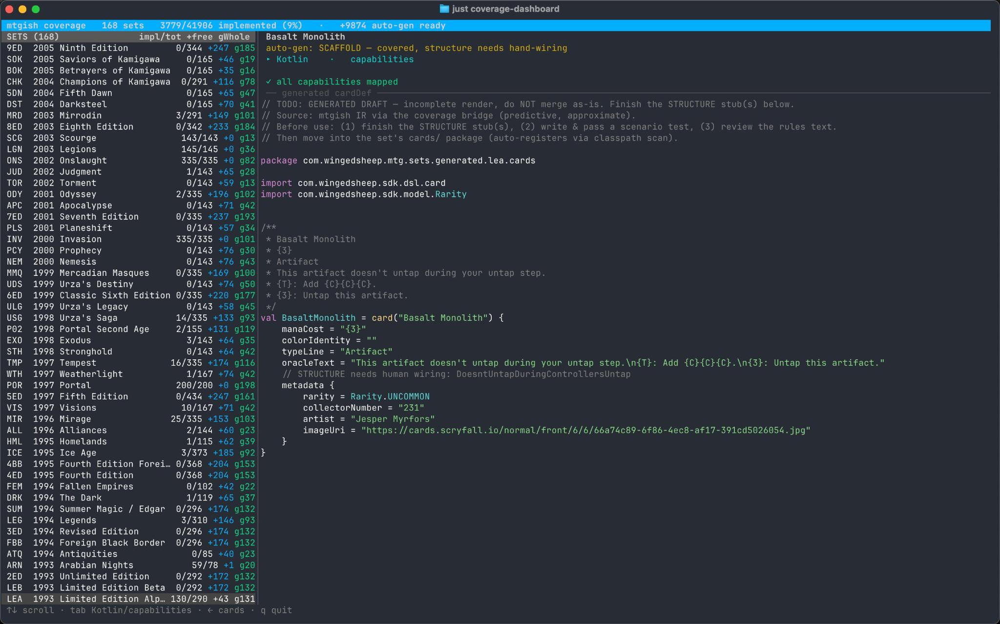

# Argentum Engine

[](https://github.com/wingedsheep/argentum-engine/actions/workflows/ci.yml)


*Before the oil. Before the corruption. There was only perfection.*

An unofficial Magic: The Gathering rules engine and online play platform. Not affiliated with, endorsed, sponsored, or specifically approved by Wizards of the Coast LLC.

**[Play now at magic.wingedsheep.com](https://magic.wingedsheep.com)** · **[Join our Discord](https://discord.gg/dy6eSRPWzu)**

---

## Overview

Argentum Engine is a modular MTG implementation composed of:

- **Rules Engine** — A deterministic Kotlin library implementing MTG comprehensive rules
- **Game Server** — Spring Boot backend for online multiplayer
- **Web Client** — Browser-based UI
- **Gym** — An RL/MCTS environment wrapper around the rules engine, with an HTTP transport for Python training loops

## Implementation Progress

Distinct implemented cards, day by day since the project began. Regenerated by `scripts/card-progress-graph`
(an interactive version lives at [`card-implementation-progress.html`](card-implementation-progress.html)).



## Getting Started

### Prerequisites

- JDK 21+
- Node.js 18+
- Docker (optional, for Redis)
- [just](https://github.com/casey/just) command runner

### Quick Start

```bash
# Initialize environment
just init

# Start Redis (optional, for session persistence)
just docker-up

# Start the game server
just server

# In another terminal, start the web client
just client
```

The client runs at `http://localhost:5173` and connects to the server at `http://localhost:8080`.

### Available Commands

**Build & Test**
| Command | Description |
|---------|-------------|
| `just build` | Build the entire project |
| `just test` | Run all tests |
| `just test-rules` | Run rules-engine tests only |
| `just test-server` | Run game-server tests only |
| `just test-gym` | Run gym tests only |
| `just test-gym-server` | Run gym-server HTTP tests only |
| `just test-gym-trainer` | Run gym-trainer (MCTS + self-play) tests only |
| `just clean` | Clean build artifacts |

**Development**
| Command | Description |
|---------|-------------|
| `just server` | Start the game server (port 8080) |
| `just gym-server` | Start the gym HTTP server (port 8081) — for RL/MCTS training |
| `just client` | Start the web client dev server |
| `just client-install` | Install web client dependencies |

**Environment**
| Command | Description |
|---------|-------------|
| `just init` | Create `.env` from `.env.example` |
| `just docker-up` | Start local Docker services (Redis) |
| `just docker-down` | Stop local Docker services |
| `just docker-logs` | View Docker logs |

### Environment Variables

Copy `.env.example` to `.env` to configure:

| Variable | Default | Description |
|----------|---------|-------------|
| `CACHE_REDIS_ENABLED` | `false` | Enable Redis for session persistence |
| `REDIS_HOST` | `localhost` | Redis host |
| `REDIS_PORT` | `6379` | Redis port |
| `GAME_AI_ENABLED` | `true` | Enable AI opponent |
| `GAME_AI_MODE` | `engine` | AI mode: `engine` (built-in) or `llm` (requires API key) |
| `OPENROUTER_API_KEY` | | OpenRouter API key (only needed for `llm` mode) |
| `GAME_AI_MODEL` | `google/gemini-3.1-flash-lite-preview` | LLM model (only for `llm` mode) |

## Tech Stack

- Kotlin 2.2
- Spring Boot 4.x
- React / TypeScript (frontend)
- Redis (optional session persistence)
- Keycloak (OAuth/authentication)

## Features

### Drafting



Host booster drafts with up to 8 players. Create a draft lobby, invite friends, and build your deck from freshly opened packs.

### Play



Play Magic against friends with fully implemented MTG rules. The engine automatically handles the stack, priority, combat, triggers, and state-based actions—so you can focus on the game.

### Free-for-All Multiplayer

Play multiplayer Free-for-All games for 2–6 players (CR 806). From a lobby, switch the mode toggle
from **Tournament** to **Free-for-All** to seat every player in a single shared game instead of a
2-player bracket — any pool-building format (sealed, draft, custom decks) composes with it.

Eliminated players are removed from the table while the remaining seats play on: conceding (or losing)
takes you out, your opponents' boards keep going, and the opponent rail shows a live tombstone for
anyone knocked out. Standings follow elimination order, and a "Play Again" ready loop lets the pod
rematch without rebuilding the lobby.

### AI Opponent

Play against an AI opponent. Two modes are available:

#### Engine AI (default)

The built-in rules-engine AI runs locally with no external dependencies. It uses multi-ply game tree search with alpha-beta pruning, a composite board evaluator, and a specialized combat advisor.

**Works out of the box** — no API key or configuration needed:

```bash
# AI is enabled by default in engine mode
GAME_AI_ENABLED=true
GAME_AI_MODE=engine
```

Start the server and client, then click **"Play vs AI"** on the main menu.

#### LLM AI (optional)

Alternatively, you can use an LLM-powered AI that sends game state to an OpenAI-compatible API for decisions.

**Setup:**

1. Get an API key from [openrouter.ai](https://openrouter.ai/) (or any OpenAI-compatible provider)
2. Add to your `.env` file:

```bash
GAME_AI_ENABLED=true
GAME_AI_MODE=llm
OPENROUTER_API_KEY=sk-or-v1-your-key-here
# GAME_AI_MODEL=google/gemini-3.1-flash-lite-preview  # optional, change model
```

The LLM AI receives the same masked game state as a human player and responds through the standard game protocol. When the LLM fails to respond or returns an unparseable answer, it falls back to heuristic play.

#### Configuration reference

| Variable | Default | Description |
|----------|---------|-------------|
| `GAME_AI_ENABLED` | `true` | Enable the AI opponent feature |
| `GAME_AI_MODE` | `llm` | `engine` — built-in AI (no API key needed); `llm` — LLM-powered AI |
| `GAME_AI_BASE_URL` | `https://openrouter.ai/api/v1` | LLM API endpoint (LLM mode only) |
| `GAME_AI_API_KEY` | | API key for LLM provider (LLM mode only) |
| `GAME_AI_MODEL` | `google/gemini-3.1-flash-lite-preview` | LLM model name (LLM mode only) |
| `GAME_AI_DECKBUILDING_MODEL` | | Separate model for AI deckbuilding; falls back to `GAME_AI_MODEL` if not set (LLM mode only) |

## Architecture

```
argentum-engine/
├── mtg-sdk/              # Shared contract — DSLs, data models, primitives
├── mtg-sets/             # Card definitions (Portal, Onslaught, Legions, Scourge, Khans, Dominaria)
├── rules-engine/         # Core MTG rules engine (no server dependencies)
├── gym/           # RL/MCTS environment wrapper (GameEnvironment, MultiEnvService)
├── gym-server/    # Spring Boot HTTP transport for gym (Python trainers)
├── gym-trainer/   # JVM-side MCTS + self-play SPI for AlphaZero-style projects
├── game-server/          # Spring Boot game server & matchmaking
├── web-client/           # React/TypeScript browser UI
└── e2e-scenarios/        # Playwright end-to-end tests
```

## Rules Engine

The rules engine is a standalone library with no server dependencies. It models the complete game state immutably and
exposes a pure functional API:

- Full turn structure (phases, steps, priority)
- Stack and spell resolution
- Combat (attackers, blockers, damage assignment)
- Triggered, activated, and static abilities
- Keywords (flying, trample, deathtouch, morph, cycling, and more)
- State-based actions
- Targeting and legality checks
- Rule 613 layer system for continuous effects
- Replacement effects

Cards are defined as pure data using a Kotlin DSL — no card-specific logic in the engine.

## Gameplay Platform

### Server

- Create games with invite links
- Booster draft with up to 8 players
- Sealed deck tournaments
- Free-for-All multiplayer games (2–6 players, CR 806)

### Client

- Real-time game state sync via WebSocket
- Targeting, combat, and decision UIs

## Gym — RL & MCTS Environment

For agent research and reinforcement-learning training, the engine also ships as a Gymnasium-style environment. A trainer drives many games in parallel against a stable JSON contract, without touching the game server or the browser UI.

### Library — `gym`

A transport-agnostic Kotlin library that wraps the rules engine in a stateful `reset / step / observe / legalActions` API with MCTS-friendly affordances:

- **Immutable state + O(1) fork** — `GameEnvironment.fork()` returns a sibling env pointing at the same `GameState`. Because state is never mutated in place, tree expansion is free.
- **Snapshot / restore** — `MultiEnvService.snapshot()` returns an opaque handle; `restore()` swaps the env back to that state in O(1). Designed to grow a byte-blob variant for cross-process MCTS workers.
- **Batch stepping** — `MultiEnvService.stepBatch()` fans out per-env steps across a work-stealing pool, so vectorised rollouts run in parallel.
- **Decision-aware** — pauses on `PendingDecision`s (scry, targets, search, distribute…); simple decisions fold into the numeric action-ID space, complex ones expose a structured response channel.
- **Stable observation schema** — `TrainingObservation` has a `schemaHash` so Python clients fail fast on contract drift; every observation carries a `stateDigest` usable as an MCTS transposition-table key.
- **Information hiding** — opponent hand and libraries are masked by default; `revealAll` is available for debug scripts.

### HTTP transport — `gym-server`

A thin Spring Boot shell that exposes `MultiEnvService` over HTTP so a Python agent can drive the engine without a JVM embedding:

| Method & path | Maps to |
|---|---|
| `POST /envs` | `MultiEnvService.create` |
| `GET /envs` | `listEnvs` |
| `DELETE /envs` | `dispose` |
| `GET /envs/{id}` | `observe` |
| `POST /envs/{id}/reset` | `reset` |
| `POST /envs/{id}/step` | `step` |
| `POST /envs/step-batch` | `stepBatch` |
| `POST /envs/{id}/decision` | `submitDecision` (structured `DecisionResponse`) |
| `POST /envs/{id}/fork?count=N` | `fork` |
| `POST /envs/{id}/snapshot` | `snapshot` |
| `POST /envs/{id}/restore` | `restore` |
| `GET /schema-hash` | observation-schema version (fail-fast on drift) |
| `GET /health` | liveness probe |

JSON is handled end-to-end by kotlinx.serialization — sealed hierarchies (`DeckSpec`, `DecisionResponse`) round-trip via `@SerialName` discriminators without extra adapter code.

Start the server with `just gym-server` (port **8081**, so it doesn't collide with the game server on 8080). Running it does not require the web client or Redis.

**Deliberately out of scope for the current scaffold:** authentication, env-lifetime TTLs, byte-based snapshots, metrics. Bind to localhost until you add auth.

### JVM-side trainer — `gym-trainer`

For AlphaZero-shaped projects that want tree search in the JVM and only use Python as a stateless NN inference server (MageZero-style): a small SPI + a PUCT MCTS + a self-play loop.

- **Four plug-in traits:** `StateFeaturizer<T>`, `ActionFeaturizer` (multi-head first-class), `Evaluator<T>`, `SelfPlaySink<T>`.
- **Built-in `AlphaZeroSearch`** with PUCT, optional Dirichlet root noise, using `GameEnvironment.fork()` for O(1) tree expansion.
- **Built-in `SelfPlayLoop`** with temperature schedule that labels training rows with the final outcome before flushing.
- **Batteries-included defaults** so a training loop runs end-to-end with zero NN setup: a heuristic evaluator wrapping the engine's `BoardEvaluator`, a structural featurizer, a hash-bucket action featurizer, a JSONL sink, and a random structured-decision resolver.
- **Wire format kept minimal** — `RemoteHttpEvaluator` POSTs features + legal slots and parses `{priors, value}`. Swap codec by subclassing.

See [`gym-trainer/README.md`](gym-trainer/README.md) for the full design write-up and a 30-line hello-world.

## Contributing

Contributions are very welcome, and I'm genuinely grateful for every PR. To keep the project
healthy, there's one rule above all others:

> **No slop PRs.** A reviewer's time is the scarcest resource here. Please open a PR only when
> you've built and tested it yourself, kept the change focused, and made it faithful to the actual
> Magic rules (no shortcuts). A polished small PR is worth far more than a large unverified one.

### Using AI to implement cards

Using AI to implement cards is encouraged — most of the card catalog is data, and the project ships
agent skills that automate the workflow correctly (Scryfall
lookup, oracle errata, set registration, scenario tests, reprint handling):

- **`add-card <CARD_NAME> <SET_CODE>`** — implement a specific card.
- **`add-random-card <SET_CODE>`** — pick a random unimplemented card from a set and implement it.

**If a card adds a new UI / UX element, test it manually** before opening the PR — AI can build the
flow, but a human needs to confirm it actually feels right in the client. Run the app (`just server`
+ `just client`), set up the situation (the `generate-scenario` skill can inject a board state), and
click through the decision yourself.

### From oracle text to Argentum code — `mtgish-tooling`



The `:mtgish-tooling` module maps the [**mtgish**](https://github.com/i5jb/mtgish) oracle-IR corpus —
a wonderful project by [**i5jb**](https://github.com/i5jb) that parses every card's oracle text into a
structured intermediate representation — onto our SDK. Huge thanks to its creator: that clean IR is
what makes this whole pipeline possible. It's a **predictive, non-authoritative** analyzer (never a
card loader): it triages the backlog and drafts the easy cards as a head start.

```bash
just coverage-dashboard       # interactive TUI: browse sets, drill into a card's generated cardDef + missing caps
just coverage --set TMP       # implemented / free-to-add / blocked, plus which feature unlocks the most cards
just coverage-generate --set TMP   # draft .kt for the auto-generable cards -> mtgish-tooling/generated/<set>/
just coverage-verify --set POR     # compile the drafts + diff their capabilities against the golden snapshot
```

Generated `.kt` are **drafts in a staging dir** — they must compile, get a passing scenario test, and
be human-reviewed before moving into a set's `cards/` package. Use it to find which feature unlocks
the most cards, or for a blank-page head start; keep using `add-card` for the real implementation. See
[`mtgish-tooling/README.md`](mtgish-tooling/README.md) for the full reference.

### Implementing a whole set

When bringing up an entire set, this flow has proven much faster than implementing cards one at a
time (it's how Invasion was done):

1. **Gap analysis.** Diff the set against the SDK/engine: which effects, triggers, conditions,
   keywords, costs, or mechanics are *missing* that you need before any card can be implemented
   cleanly? Produce the full list up front. (Invasion needed roughly 25 new features.)
2. **Plan each missing feature for elegance and reuse.** For every gap, design the implementation so
   it composes complex effects from small reusable atoms rather than a one-off type per card — think
   about the SDK as a whole and the *next* card, not just the one in front of you. Use the
   **`add-feature`** skill, which encodes these principles end to end.
3. **Implement the features one by one, with care.** This is the step that pays off later, so give it
   attention: write tests, and **manually test the UX** for anything that touches the client. Some
   features are deep — Invasion's banding required rewriting the whole combat system — so don't rush
   them.
4. **Then fan out the cards.** Once the building blocks exist, most cards need no engine changes. Add
   them in parallel — e.g. spawn a few agents, each using the `add-card` skill to implement a handful
   of cards, and have each open a PR when its batch is done.
5. **Review engine changes.** Cards will occasionally still need a small engine tweak. When a PR adds
   or changes engine/SDK code, run **`review-changes <PR_URL>`** on it — this checks for elegance and
   correctness and keeps the engine/SDK clean. (Card-only PRs with no engine changes don't need it.)
6. **Feed the work back into the mtgish generator.** Ideally, every new feature and card you implement
   also becomes something the [`:mtgish-tooling`](mtgish-tooling/README.md) generator can *predict and
   draft* — a capability entry in the bridge (`coverage/bridge/`) plus a rendering handler in the
   emitter (`coverage/emitter/*Handlers.kt`). This has wider benefits than the one card: the tooling
   maps the mtgish IR corpus across *every* set, so one bridge/emitter entry typically unlocks coverage
   and auto-draft for many more cards that share the mechanic. Confirm with
   `just coverage-verify --set <SET>` that the cards you just implemented now classify as
   coverable/AUTO. (The `add-feature` and `add-card` skills both prompt for this step.)

### Guidelines

- Read [`AGENTS.md`](AGENTS.md) and [`docs/architecture-principles.md`](docs/architecture-principles.md)
  first — they describe the load-bearing rules (immutability, projected state, events-not-mutations,
  server-authoritative client) that PRs are reviewed against.
- Prefer composing existing primitives over adding new SDK types; when you do add a type, parameterize
  it and name the mechanic, not the card.
- Update [`docs/card-sdk-language-reference.md`](docs/card-sdk-language-reference.md) in the same
  change whenever you add or change anything in the SDK.
- Verify Comprehensive Rules numbers via the official WotC rules page <https://magic.wizards.com/en/rules>
  before citing them in code, comments, or commit messages. The linked plain-text `.txt` is too large to fetch
  into context — download it and `grep` locally.
- Run `just build` (simple changes) or `just test` (new effects/engine changes) and confirm green
  before opening the PR.

Questions or ideas? [Join the Discord](https://discord.gg/dy6eSRPWzu).

## Why "Argentum"?

Argentum was a plane of mathematical perfection, created by the planeswalker Karn. Every angle intentional, every law
absolute. It was governed by rules so elegant they seemed inevitable.

That's what a rules engine should be.
