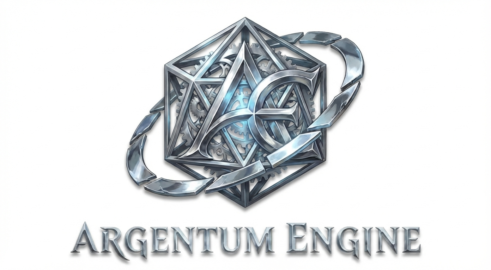
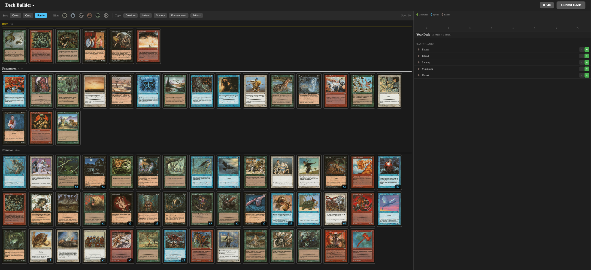
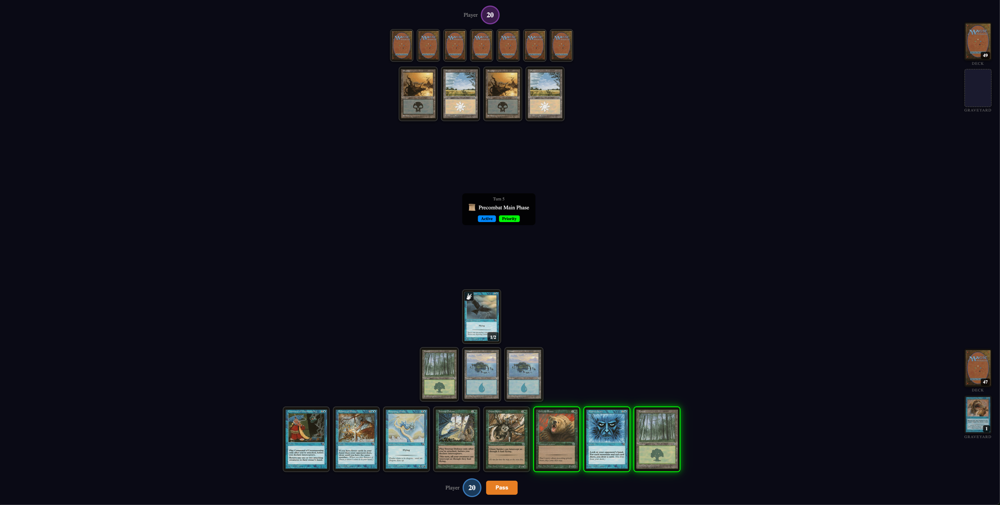

# Argentum Engine



*Before the oil. Before the corruption. There was only perfection.*

An unofficial Magic: The Gathering rules engine and online play platform. Not affiliated with, endorsed, sponsored, or specifically approved by Wizards of the Coast LLC.

**[Play now at magic.wingedsheep.com](https://magic.wingedsheep.com)**

---

## Overview

Argentum Engine is a modular MTG implementation consisting of:

- **Rules Engine** — A deterministic Kotlin library implementing MTG comprehensive rules
- **Game Server** — Spring Boot backend for online multiplayer
- **Web Client** — Browser-based UI

## Getting Started

### Prerequisites

- JDK 21+
- Node.js 18+
- Docker (optional, for Redis)
- [just](https://github.com/casey/just) command runner

### Quick Start

```bash
# Initialize environment
just init

# Start Redis (optional, for session persistence)
just docker-up

# Start the game server
just server

# In another terminal, start the web client
just client
```

The client runs at `http://localhost:5173` and connects to the server at `http://localhost:8080`.

### Available Commands

**Build & Test**
| Command | Description |
|---------|-------------|
| `just build` | Build the entire project |
| `just test` | Run all tests |
| `just test-rules` | Run rules-engine tests only |
| `just test-server` | Run game-server tests only |
| `just clean` | Clean build artifacts |

**Development**
| Command | Description |
|---------|-------------|
| `just server` | Start the game server |
| `just client` | Start the web client dev server |
| `just client-install` | Install web client dependencies |

**Environment**
| Command | Description |
|---------|-------------|
| `just init` | Create `.env` from `.env.example` |
| `just docker-up` | Start local Docker services (Redis) |
| `just docker-down` | Stop local Docker services |
| `just docker-logs` | View Docker logs |

### Environment Variables

Copy `.env.example` to `.env` to configure:

| Variable | Default | Description |
|----------|---------|-------------|
| `CACHE_REDIS_ENABLED` | `false` | Enable Redis for session persistence |
| `REDIS_HOST` | `localhost` | Redis host |
| `REDIS_PORT` | `6379` | Redis port |
| `GAME_AI_ENABLED` | `true` | Enable AI opponent |
| `GAME_AI_MODE` | `engine` | AI mode: `engine` (built-in) or `llm` (requires API key) |
| `OPENROUTER_API_KEY` | | OpenRouter API key (only needed for `llm` mode) |
| `GAME_AI_MODEL` | `google/gemini-3.1-flash-lite-preview` | LLM model (only for `llm` mode) |

## Tech Stack

- Kotlin 2.2
- Spring Boot 4.x
- React / TypeScript (frontend)
- Redis (optional session persistence)
- Keycloak (OAuth/authentication)

## Features

### Drafting



Host booster drafts with up to 8 players. Create a draft lobby, invite friends, and build your deck from freshly opened packs.

### Play



Play Magic against friends with fully implemented MTG rules. The engine automatically handles the stack, priority, combat, triggers, and state-based actions—so you can focus on the game.

### AI Opponent

Play against an AI opponent. Two modes are available:

#### Engine AI (default)

The built-in rules-engine AI runs locally with no external dependencies. It uses multi-ply game tree search with alpha-beta pruning, a composite board evaluator, and a specialized combat advisor.

**Works out of the box** — no API key or configuration needed:

```bash
# AI is enabled by default in engine mode
GAME_AI_ENABLED=true
GAME_AI_MODE=engine
```

Start the server and client, then click **"Play vs AI"** on the main menu.

#### LLM AI (optional)

Alternatively, you can use an LLM-powered AI that sends game state to an OpenAI-compatible API for decisions.

**Setup:**

1. Get an API key from [openrouter.ai](https://openrouter.ai/) (or any OpenAI-compatible provider)
2. Add to your `.env` file:

```bash
GAME_AI_ENABLED=true
GAME_AI_MODE=llm
OPENROUTER_API_KEY=sk-or-v1-your-key-here
# GAME_AI_MODEL=google/gemini-3.1-flash-lite-preview  # optional, change model
```

The LLM AI receives the same masked game state as a human player and responds through the standard game protocol. When the LLM fails to respond or returns an unparseable answer, it falls back to heuristic play.

#### Configuration reference

| Variable | Default | Description |
|----------|---------|-------------|
| `GAME_AI_ENABLED` | `true` | Enable the AI opponent feature |
| `GAME_AI_MODE` | `llm` | `engine` — built-in AI (no API key needed); `llm` — LLM-powered AI |
| `GAME_AI_BASE_URL` | `https://openrouter.ai/api/v1` | LLM API endpoint (LLM mode only) |
| `GAME_AI_API_KEY` | | API key for LLM provider (LLM mode only) |
| `GAME_AI_MODEL` | `google/gemini-3.1-flash-lite-preview` | LLM model name (LLM mode only) |
| `GAME_AI_DECKBUILDING_MODEL` | | Separate model for AI deckbuilding; falls back to `GAME_AI_MODEL` if not set (LLM mode only) |

## Architecture

```
argentum-engine/
├── mtg-sdk/          # Shared contract — DSLs, data models, primitives
├── mtg-sets/         # Card definitions (Portal, Onslaught, Legions, Scourge, Khans, Dominaria)
├── rules-engine/     # Core MTG rules engine (no server dependencies)
├── game-server/      # Spring Boot game server & matchmaking
├── web-client/       # React/TypeScript browser UI
└── e2e-scenarios/    # Playwright end-to-end tests
```

## Rules Engine

The rules engine is a standalone library with no server dependencies. It models the complete game state immutably and
exposes a pure functional API:

- Full turn structure (phases, steps, priority)
- Stack and spell resolution
- Combat (attackers, blockers, damage assignment)
- Triggered, activated, and static abilities
- Keywords (flying, trample, deathtouch, morph, cycling, and more)
- State-based actions
- Targeting and legality checks
- Rule 613 layer system for continuous effects
- Replacement effects

Cards are defined as pure data using a Kotlin DSL — no card-specific logic in the engine.

## Gameplay Platform

### Server

- Create games with invite links
- Booster draft with up to 8 players
- Sealed deck tournaments

### Client

- Real-time game state sync via WebSocket
- Targeting, combat, and decision UIs

## Why "Argentum"?

Argentum was a plane of mathematical perfection, created by the planeswalker Karn. Every angle intentional, every law
absolute. It was governed by rules so elegant they seemed inevitable.

That's what a rules engine should be.
